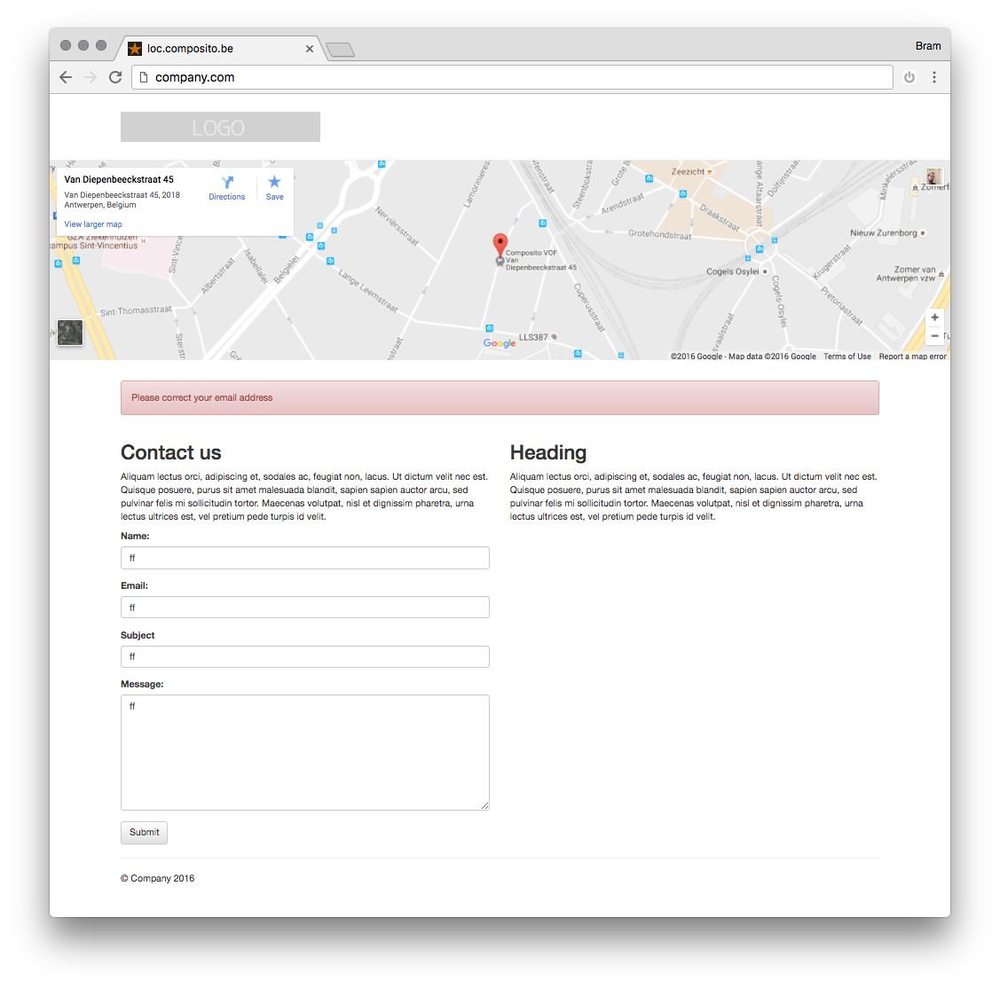

# PHP HTML5 contact form with google maps

- Honeypot spam prevention
- HTML5
- HTML5 form validation
- PHP serverside validation
- PHP 7+
- Responsive
- Bootstrap 
- Drag and drop install
- Google maps 
- Google analytics

## Installation

Just edit the index.php and add your email addres, logo, Google maps integration and Google Analytics code. Upload to your webserver that supports PHP. 